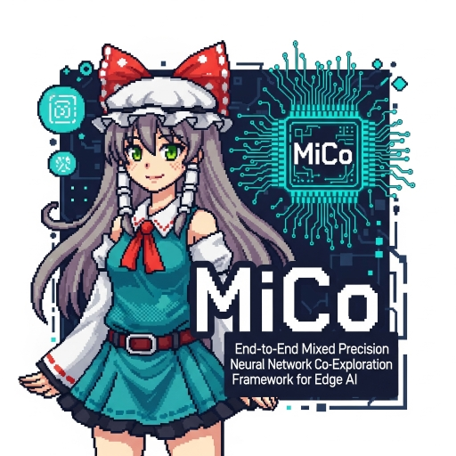

# MiCo: End-to-End Mixed Precision Neural Network Co-Exploration Framework for Edge AI

This is the Python codebase for MiCo Framework. 

MiCo is an end-to-end framework that helps you train/explore/deploy mixed precision quantized models.

## Pre-requisite

```shell
conda create -n mico_env python=3.10
conda activate mico_env

conda install pygmo
pip install -r requirements.txt
```

If you encounter `ModuleNotFoundError` when trying to import local packages here, before you run the code:
```shell
export PYTHONPATH=$PYTHONPATH:.
```

## Getting Start

**To run Mixed Precision Search**:

Check `examples`, run the training code first and use the trained model for MPQ Search.
For example:
```shell
python examples/lenet_mnist.py # Train LeNet on MNIST
python examples/lenet_mnist_search.py # MPQ Search on trained LeNet
```

**General Scripts**:
```shell
# For General Script Usage
python examples/mpq_train.py -h
python examples/mpq_search.py -h
```

**To use the CodeGen**, check the code to change the models/datasets/precisions:
```shell
python MiCoCodeGen.py
```

**To compile the inference code** after generating the model header with the CodeGen:
```shell
git submodule update --init
cd project
make clean
make MAIN=main TARGET=<host, vexii> OPT=<unroll, simd>
```
**To run the inference on your host machine** after compilation:
```shell
make run-host
```
**To run the inference simulation on the VexiiRiscv** after compilation:

Check the [VexiiRiscv document](https://spinalhdl.github.io/VexiiRiscv-RTD/master/VexiiRiscv/HowToUse/index.html#run-a-simulation), load the elf from `project` to the simulator.

## Supported Models
| Model | Layers | MPQ Search | MPQ Deploy (C) | MPQ Deploy (DNNWeaver) |
| ----- | ------ | ---------- | ---------- | ---------- |
| MLP   | Linear         | Supported | Supported | Supported |
| HARMLP | Linear        | Supported | Supported | Supported |
| LeNet | Linear, Conv2D | Supported | Supported | Supported |
| CNN   | Linear, Conv2D | Supported | Supported | Supported |
| VGG   | Linear, Conv2D | Supported | Supported | Supported |
| ResNet | Linear, BottleNeck (Conv2D) | Supported | Supported | Supported |
| MobileNetV2 | Linear, BottleNeck (Conv2D) | Supported | Supported | Supported |
| SqueezeNet | Linear, Conv2D | Supported | Supported | Supported |
| ShuffleNet | Linear, Conv2D | Supported | Supported | Not Yet |
| LLaMa | Transformers (Linear) | Supported | Supported | Not Yet |
| ViT   | Transformers (Linear) | Supported | Not Yet | Not Yet |

## Supported Datasets

Currently MiCo includes the following datasets:

+ MNIST
+ Fashion MNIST
+ CIFAR-10
+ CIFAR-100
+ TinyStories
+ UCI HAR (wearable sensors)

## Main Components
Here are the main components/modules of MiCo.

**Basics**
+ `MiCoUtils`: Utilities for MiCo framework, including layer replacing, exporting, etc..
+ `MiCoModel`: Basic model class of MiCo, offering unified training/testing methods, and the layer-wise bitwidth assignment method.
+ `MiCoQLayers`: Fundamental quantized layer classes for MiCo models and quantization functions.
+ `MiCoEval`: Model evaluation for MiCo models, evaluating accuracy, BOPs, MACs, end-to-end latency results.
+ `MiCoAnalysis`: Various statistics for quantized models.

**Codegen**
+ `MiCoCodeGen`： C code generator for MiCo models.
+ `MiCoGraphGen`: DNN Weaver Op graph generator for MiCo models.
+ `MiCoLLaMaGen`: C code generator for MiCo TinyLLaMa models.

**Searchers**
+ `searchers.MiCoSearcher`: Main MPQ searcher of MiCo framework.

**Hardware-Aware**
+ `SimUtils`: Invoke simulations for BitFusion or VexiiRiscv hardware.
+ `MiCoProxy`: CBOPs proxy models for hardware latency predictions.

## Folder Structure
+ `examples`: Example scripts for MPQ training/searching.
+ `deploy`: Example scripts for hardware-aware end-to-end MPQ search-deploy flow.
+ `searchers`: Implementations of MPQ searching algorithms.
+ `models`: MPQ models.
+ `profile`: Scripts for hardware profiling (require hardware submodules).
+ `project`: C project templates for MPQ inference on CPUs (require MiCo Library submodule).
+ `benchmark_results`: Profiled hardware kernel datasets for hardware-aware proxy models.

## Publication

Please refer to the paper for details.

```bibtex
@inproceedings{jiang2025mico,
  title={MiCo: End-to-End Mixed Precision Neural Network Co-Exploration Framework for Edge AI},
  author={Jiang, Zijun and Lyu, Yangdi},
  booktitle={Proceedings of 2025 IEEE/ACM International Conference on Computer-Aided Design (ICCAD)},
  pages={1--9},
  year={2025},
  organization={IEEE}
}
```

## Acknowledgement

ucb-bar/Baremetal-NN (For Codegen with Torch FX Interpreter):

https://github.com/ucb-bar/Baremetal-NN

mit-han-lab/haq (For HAQ Searcher Implementation):

https://github.com/mit-han-lab/haq

weiaicunzai/pytorch-cifar100 (For torch models):

https://github.com/weiaicunzai/pytorch-cifar100

karpathy/llama2.c (For LLaMa2 and TinyStories scripts and c codes):

https://github.com/karpathy/llama2.c

## Roadmap

Check our [Roadmap](/../../issues/1) to see what's on the plan!

---
<p align="center">

</p>
Generated with Gemini-2.5 Flash.
